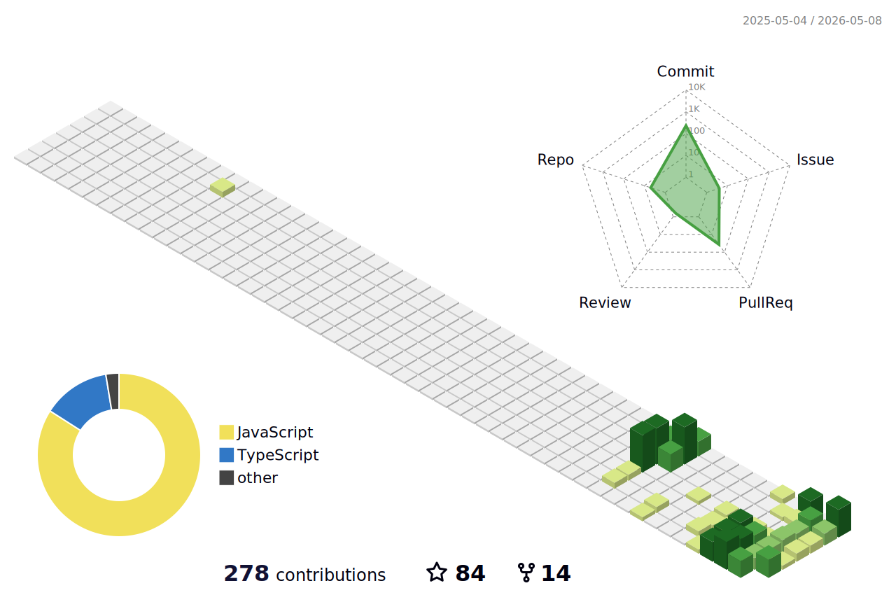

<div align="center">


<br />


<br />
<br />

<p>
  
  
  
  
  
  
  
  
</p>

</div>

---

## Hi there 👋

I’m interested in building practical tools for **3D web visualization**, **geospatial scenes**, and **large 3D data workflows**.

Recently, my work has been focused around **3D Gaussian Splatting**, **3D Tiles**, **Three.js**, and **CesiumJS** — especially how large 3D scenes can be converted, streamed, inspected, aligned, and rendered more smoothly in the browser.

I like working on problems where graphics, performance, data size, and developer experience all matter.

---

## What I’m exploring

<table>
  <tr>
    <td>🧊 <b>Gaussian Splatting</b></td>
    <td>Making 3DGS data easier to use in real web workflows</td>
  </tr>
  <tr>
    <td>🌍 <b>WebGIS</b></td>
    <td>Connecting 3D content with real geospatial environments</td>
  </tr>
  <tr>
    <td>🧱 <b>3D Tiles</b></td>
    <td>Organizing and streaming large 3D scenes in the browser</td>
  </tr>
  <tr>
    <td>⚡ <b>Performance</b></td>
    <td>Improving loading, LOD behavior, and runtime experience</td>
  </tr>
  <tr>
    <td>🛠️ <b>Developer Tools</b></td>
    <td>Building tools for inspection, alignment, and editing</td>
  </tr>
</table>

---

## Selected work

<table>
  <tr>
    <td>
      <h3>🧊 3DGS / 3D Tiles Converter</h3>
      <p>Tools for bringing Gaussian Splatting data into tiled web workflows.</p>
      <a href="https://github.com/WilliamLiu-1997/3DGS-PLY-3DTiles-Converter">View repository →</a>
    </td>
    <td>
      <h3>🌐 3DGS Renderer Plugin</h3>
      <p>Browser rendering experiments around Gaussian Splatting and 3D Tiles.</p>
      <a href="https://github.com/WilliamLiu-1997/3D-Tiles-RendererJS-3DGS-Plugin">View repository →</a>
    </td>
  </tr>
  <tr>
    <td>
      <h3>🛠️ 3D Tiles Inspector</h3>
      <p>Local tools for inspecting and adjusting 3D Tiles workflows.</p>
      <a href="https://github.com/WilliamLiu-1997/3DTiles-Inspector">View repository →</a>
    </td>
    <td>
      <h3>🧪 Experiments</h3>
      <p>Other experiments around 3D graphics, interaction, and visualization.</p>
      <a href="https://github.com/WilliamLiu-1997?tab=repositories">View all repositories →</a>
    </td>
  </tr>
</table>

---

## Commit activity

<p align="center">
  
</p>

---

## Current direction

```txt
3D data
  ↓
Conversion / organization
  ↓
Tiled streaming
  ↓
Inspection / alignment
  ↓
Browser rendering
  ↓
WebGIS / digital twin workflows
```
